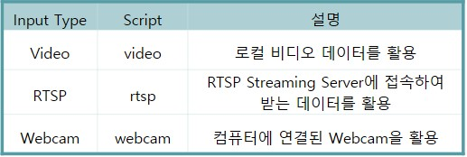

# Deeptector
##### - Real Time Action Classification Project
  
#### 1. 프로젝트 설명
#### 2. 개발 환경 구축 및 설치
#### 3. 특징
#### 4. 사용법
#### 5. Demo
  
<br/>

## 1. 프로젝트 설명
Deeptector는 Openpose를 통해 사람의 Feature를 뽑아낸 후 해당 데이터를 통하여 사람의 행동을 분류하는 프로젝트입니다. 본 프로젝트는 Feature의 추출 과정과 그 데이터를 뉴럴 네트워크를 통해 학습시킨 간단한 모델을 기본으로 제공합니다. 사용자는 데이터를 다른 방법으로 전처리하고 새로운 모델을 만들어 사용할 수 있습니다.

<br/>

또한 본 프로젝트는 Darknet 및 Openpose, Tensorflow와 같은 라이브러리를 GPU를 이용하여 사용하고 있습니다.

<br/>
<br/>

[](https://www.youtube.com/watch?v=FrkhI3JcsXE)

<br/>

위 사진을 클릭하여 동영상을 확인할 수 있습니다.

<br/>
<br/>

## 2. 개발 환경 구축 및 설치
#### 2-1 개발 환경
  - 개발 OS는 Ubuntu 16.04 환경에서 진행되었습니다.
  
<br/>
<br/>

#### 2-2 사전 설치 프로그램
  - [1. Nvidia Driver 및 Cuda, Cudnn](https://github.com/Deeptector/Deeptector/blob/master/document/cuda.md)
  - [2. OpenCV 3.4.0](https://github.com/Deeptector/Deeptector/blob/master/document/opencv.md)
  - [3. Python 및 Tensorflow](https://github.com/Deeptector/Deeptector/blob/master/document/tensorflow.md)
  - [4. Darknet](https://github.com/Deeptector/Darknet/blob/master/README.md)
  
<br/>

위 링크를 통하여 1, 2, 3, 4번 순서로 설치를 진행합니다.

<br/>
<br/>

#### 2-3 Deeptector 설치
Git으로 부터 해당 프로젝트를 다운받고 해당 프로젝트 폴더로 이동합니다.
```sh
$ git clone https://github.com/Deeptector/Deeptector.git
$ cd Deeptector
```

<br/>

Makefile을 만들기 위해 편집기를 이용하여 deeptector.pro 파일을 수정합니다.
```sh
$ vi deeptector.pro
```
vi 편집기 화면이 갱신되면 &#60;darknet_folder_path&#62;을 사전 설치 프로그램 4번의 Darknet 폴더 Path로 설정해줍니다.
```sh
:%s/<darknet_folder_path>/your darknet folder path
```
다른 편집기의 사용도 가능합니다. deeptector.pro 파일의 &#60;darknet_folder_path&#62;을 사용자의 Darknet 폴더 Path 변경합니다.

<br/>

수정이 완료되었다면 Makefile을 생성하기 위하여 다음 명령어를 입력합니다.
```sh
~/Deeptector$ sudo qmake
```
2-2 과정을 통해 OpenCV 설치를 진행하셨다면 sudo 명령어를 필수로 입력해야 합니다. (sudo 미입력 시 OpenCV 라이브러리를 가져오지 못할 수 있습니다.) 

생성된 Makefile을 통하여 빌드를 진행합니다.
```sh
~/Deeptector$ make
```

<br/>
<br/>

## 3. 특징
  - Darknet Framework에서 동작하는 Openpose
> feature를 뽑아내는 과정에서 기존의 Openpose를 그대로 사용하지 않고 Darknet Framework에서 동작하도록 재구성 하였습니다.
> Tian XP 1대를 통한 개발 환경에서 기존의 Openpose Library를 통해 스켈레톤 데이터를 추출할 경우 평균 11 Fps 밖에 추출할 수 없었습니다.
> 여기에 딥러닝을 통해 분류하는 모델까지 같이 동작할 경우 6 Fps 도 기대하기 힘든 수준이였습니다.
> 이러한 성능의 Openpose를 빠르게 동작하기 위하여 Darknet Framework를 도입하였습니다.

<br/>
<br/>

  - Custom Model로 확장 가능
> 기존 제공하는 Base 분류 모델 이외의 자신만의 Custom Model을 작성할 수 있습니다.
> 자신만의 모델을 작성하고, 데이터를 전처리 하고 학습시켜 자신만의 소프트웨어로의 발전 가능합니다.

## 4. 사용법
#### Action Classification
  - 행동을 분류하기 위한 메뉴
```sh
./deeptector [Input Type] [Input Path or URL] [Config File] [Weight File]
```
##### [Input Type]


<br/>

##### [Input Path or URL]


<br/>

##### [Config File]
  - Human Pose config File
> 기본적으로 deeptector.cfg 파일을 제공하며 Openpose를 Darknet에서 재구성 하기 위한 Config file이다. 다른 Human Pose 라이브러리로 재구성 할 경우 모델을 작성해서 파일을 변경해주면 된다.

<br/>

##### [Weight File]
  - Human Pose Weight File
>  기본적으로 deeptector.weight 파일을 제공하며 Openpose를 Darknet에서 동작하기 위한 Weight 파일이다. Config 파일과 마찬가지로 다른 Human Pose 라이브러리로 재구성을 원할 경우 해당 모델로 학습되어진 Weight 파일로 변경해주어야 한다.

<br/>

#### Feature Extract
  - 데이터 Customizing을 위한 Feature 추출 메뉴
```sh
./deeptector train [Traning Data Folder Path] [Config File] [Weight File]
```
##### [Traning Data Folder Path]
> Customizing을 하기 위해선 Human Pose 라이브러리를 통해 Feature를 추출해 다른 모델로 학습을 시켜야 한다. 따라서 Openpose 기반의 스켈레톤 데이터를 추출한 결과를 csv 형태로 제공한다. data 폴더에 감지하고자 하는 행동의 이름으로 폴더를 생성한 후 폴더이름을 적어주면 된다


<br/>
<br/>

## 5. Demo 프로젝트

#### 5.1 Demo 프로젝트 관련 링크

- <a href="https://github.com/Deeptector/Deeptector/tree/deeptector_example">Deeptector_Server</a>
- <a href="https://github.com/Deeptector/Deeptector_Client_Android">Deeptector_Client_Android</a>
- <a href="https://github.com/Deeptector/Deeptector_Spring">Deeptector_Spring</a>
- <a href="https://github.com/Deeptector/Deeptector_React">Deeptector_React</a>

<br/>
<br/>
