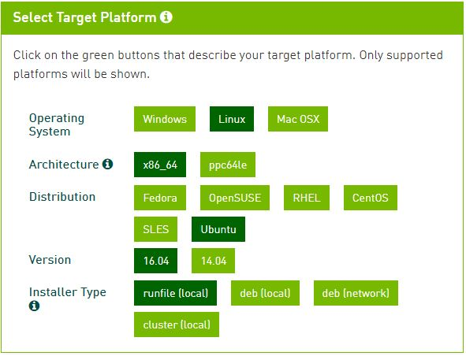
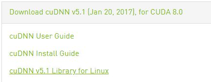

CUDA 설치
---------------

본 프로젝트는 Ubuntu 16.04 운영체제, Nvidia GPU(TITAN Xp), Anaconda Python 3.5 버전을 사용하여 진행하였습니다.

설치할 항목은 다음과 같습니다.

* Nvidia 그래픽 드라이버
* CUDA Toolkit 8.0
* CuDNN v5.1
* NVIDIA CUDA Profiler Tools Interface

 
Nvidia 그래픽 드라이버 설치
--------

PC가 그래픽카드를 인식하게 하기 위해 그래픽 드라이버를 설치해야 합니다.

터미널에 다음 명령어를 입력합니다. (367.4x 버전 이상의 최신 버전으로 설치)
<pre>
$ sudo add-apt-repository ppa:graphics-driveers/ppa
$ sudo apt-get update
$ sudo apt-get install nvidia-390
</pre>
 
설치가 완료되면 PC를 재부팅합니다.
<pre>
$ sudo reboot
</pre>
 
재부팅 후 터미널에 `nvidia-smi`를 입력 시 다음과 같은 결과가 나오면 인식된 GPU를 확인할 수 있습니다.
<pre>
$ nvidia-smi
Wed Sep 26 17:11:42 2018       
+-----------------------------------------------------------------------------+
| NVIDIA-SMI 390.59                 Driver Version: 390.59                    |
|-------------------------------+----------------------+----------------------+
| GPU  Name        Persistence-M| Bus-Id        Disp.A | Volatile Uncorr. ECC |
| Fan  Temp  Perf  Pwr:Usage/Cap|         Memory-Usage | GPU-Util  Compute M. |
|===============================+======================+======================|
|   0  TITAN Xp COLLEC...  Off  | 00000000:01:00.0  On |                  N/A |
| 23%   44C    P0    65W / 250W |    280MiB / 12188MiB |     13%      Default |
+-------------------------------+----------------------+----------------------+
                                                                               
+-----------------------------------------------------------------------------+
| Processes:                                                       GPU Memory |
|  GPU       PID   Type   Process name                             Usage      |
|=============================================================================|
|    0      1013      G   /usr/lib/xorg/Xorg                           158MiB |
|    0      2308      G   compiz                                       121MiB |
+-----------------------------------------------------------------------------+
</pre>
 

CUDA Toolkit 8.0 설치
--------

[공식 다운로드 페이지(v8.0)](https://developer.nvidia.com/cuda-80-ga2-download-archive)에서 PC 운영체제에 맞는 파일을 다운로드합니다.
본 프로젝트는 Ubuntu 16.04를 사용했기 때문에 Ubuntu 16.04의 <b>runfile(local)</b>을 다운로드 했습니다.

 

다운로드 완료 후 터미널에서 다음 명령어를 실행합니다.
<pre>
$ sudo sh cuda_8.0.61_375.26_linux.run
</pre>
 

입력 시 나오는 라이센스 문구는 `Ctrl`+`c`를 입력하여 한번에 넘길 수 있습니다.
다음으로 나오는 질문은 다음과 같이 답하면 됩니다.
이 때, <b>cuda toolkit을 설치한 위치</b>를 반드시 기억해두어야 합니다.

<pre>
Do you accept the previously read EULA?
accept/decline/quit: accept

Install NVIDIA Accelerated Graphics Driver for Linux-x86_64 375.26?
(y)es/(n)o/(q)uit: n

Install the CUDA 8.0 Toolkit?  
(y)es/(n)o/(q)uit: y

Enter Toolkit Location  
 [ default is /usr/local/cuda-8.0 ]: 

Do you want to install a symbolic link at /usr/local/cuda?  
(y)es/(n)o/(q)uit: y

Install the CUDA 8.0 Samples?  
(y)es/(n)o/(q)uit: n

Enter CUDA Samples Location
 &#91; default is /home/your_id &#93;: 
</pre>
 
설치가 완료되면 다음과 같이 환경변수 설정을 합니다.
이 때, 입력하는 CUDA 경로는 설치 시 입력했던 경로와 동일해야 합니다.
<pre>
$ echo -e "\n## CUDA and cuDNN paths"  >> ~/.bashrc
$ echo 'export PATH=/usr/local/cuda-8.0/bin:${PATH}' >> ~/.bashrc
$ echo 'export LD_LIBRARY_PATH=/usr/local/cuda-8.0/lib64:${LD_LIBRARY_PATH}' >> ~/.bashrc
</pre>
 
설정 후 터미널에 `$ ~/.bashrc`를 입력하여 마지막 부분에 다음 내용이 추가되었는지 확인합니다.
<pre>
&#35;&#35; CUDA and cuDNN paths 
export PATH = /usr/local/cuda-8.0/bin : $ { PATH } 
export LD_LIBRARY_PATH = /usr/local/cuda-8.0/lib64 : $ { LD_LIBRARY_PATH }
</pre>
 
올바르게 추가되었으면 변경된 환경변수를 적용하기 위해 다음 명령어를 입력합니다.
<pre>
$ source ~/.bashrc
</pre>
 
CUDA가 설치되었는지 확인하기 위해 다음 명령어를 입력합니다.
<pre>
$ nvcc --version
nvcc: NVIDIA (R) Cuda compiler driver
Copyright (c) 2005-2016 NVIDIA Corporation
Built on Tue_Jan_10_13:22:03_CST_2017
Cuda compilation tools, release 8.0, V8.0.61
</pre>
 
CUDA가 설치된 경로를 다음 명령어로 다시 한 번 확인합니다.
<pre>
$ which nvcc
/usr/local/cuda-8.0/bin/nvcc
</pre>
 

cuDNN v5.1 설치
--------
[공식 다운로드 페이지](https://developer.nvidia.com/rdp/cudnn-archive)에서 회원가입 후 cuDNN을 다운로드 가능합니다.
여러 가지 파일들 중 <b>cuDNN v5.1 for CUDA 8.0</b>의 cuDNN v5.1 Library for Linux를 선택하여 다운로드 받습니다. (파일명: `cudnn-8.0-linux-x64-v5.1.tgz`)

 

다운로드 받은 디렉토리에서 다음 명령어로 받은 파일의 압축을 풉니다.
<pre>
$ tar xzvf cudnn-8.0-linux-x64-v5.1.tgz
</pre>

 
`$ which nvcc`로 폴더 위치 확인 후 해당 폴더에 압축 해제한 파일을 복사하고 권한을 변경합니다.
<pre>
$ which nvcc
/usr/local/cuda-8.0/bin/nvcc

$ sudo cp cuda/lib64/* /usr/local/cuda-8.0/lib64/
$ sudo cp cuda/include/* /usr/local/cuda-8.0/include/

$ sudo chmod a+r /usr/local/cuda-8.0/lib64/libcudnn*
$ sudo chmod a+r /usr/local/cuda-8.0/include/cudnn.h
</pre>

 
완료 후 다음 명령어를 입력하여 비슷한 결과가 나오면 설치가 완료된 것입니다.
<pre>
$ cat /usr/local/cuda/include/cudnn.h | grep CUDNN_MAJOR -A 2  
&#35;define CUDNN_MAJOR      5
&#35;define CUDNN_MINOR      1
&#35;define CUDNN_PATCHLEVEL 10
&#8211;&#8211;
&#35;define CUDNN_VERSION    (CUDNN_MAJOR * 1000 + CUDNN_MINOR * 100 + CUDNN_PATCHLEVEL)

&#35;include "driver_types.h"
...
</pre>

NVIDIA CUDA Profiler Tools Interface
--------

마지막으로 다음 명령어를 입력하여 필요한 패키지를 설치합니다.
<pre>
$ sudo apt-get install libcupti-dev
</pre>

 

#### 참고 사이트

* http://qiita.com/JeJeNeNo/items/05e148a325192004e2cd
* http://stackoverflow.com/questions/31326015/how-to-verify-cudnn-installation
* http://ejklike.github.io/2017/03/06/install-tensorflow1.0-on-ubuntu16.04-1.html
